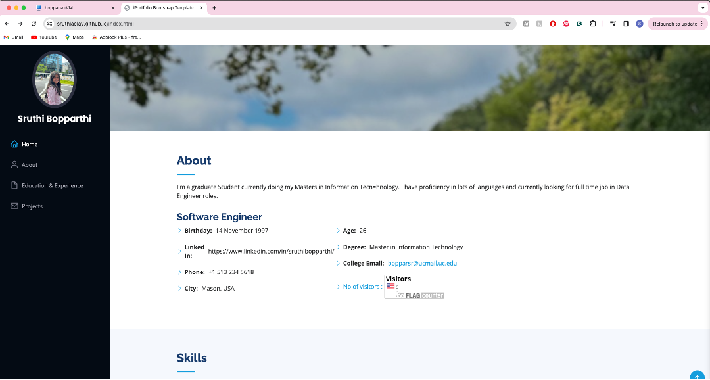

# WAPH-Web Application Programming and Hacking

## Instructor: Dr. Phu Phung

## Student

### Name: Sruthi Sridhar Bopparthi
### Email: bopparsr@mail.uc.edu

## Repository Information
### Repository's URL: [https://github.com/SruthiAelay/SruthiAelay.github.io/tree/main](https://github.com/SruthiAelay/SruthiAelay.github.io/tree/main)
### This is a private repository which is used to store all the codes related to course Topics in Computer Systems. The structure of this repository is as mentioned below.

# Project 1

## Project overview

 In Project 1, we'll take the opportunity to showcase our professional identity by deploying a website on Github. This website will serve as a virtual resume, presenting our skills, experiences, and achievements. To make it visually appealing and functional, we'll leverage various front-end technologies such as HTML, CSS, and JavaScript. This project not only focuses on the technical aspects but also incorporates non-technical elements, ensuring a well-rounded and comprehensive representation of our capabilities. It's a chance to create an impressive online presence that reflects both our expertise and personality.

 Link to Project code : [https://github.com/SruthiAelay/SruthiAelay.github.io/tree/main](https://github.com/SruthiAelay/SruthiAelay.github.io/tree/main)

 For this Project i have downloaded Resume themed bootstrap from [https://bootstrapmade.com/bootstrap-resume-cv-templates/](https://bootstrapmade.com/bootstrap-resume-cv-templates/) where in i have added and made changed according to the needs of my Resume and portfolio. It includes, my name, Photo, Educational and Experience background along with Projects. I have also included a link to previous lab's, Hackathons overview.

 I have included page tracked by using [https://flagcounter.com/](https://flagcounter.com/). by adding this, we would be able to keep track on how many users are visiting my Resume Portfolio. I have also added some code from Lab2 which used JQuery, for Analog and Digital Time, Display email onclick event. Along with it I have added an extra functionality of my own choice by using Angular, i.e Counter. This counter tells the user how many times the button is pressed.

I added a joke API and https://xkcd.com/info.0.json API to show an image, title, and details. I also used cookies to check if the user is visiting for the first time or has been here before, displaying the time and date of the previous visit.

